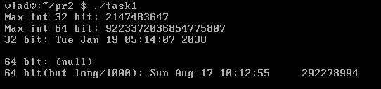
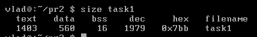

# Завдання 1: визначення моменту закінчення `time_t` та дослідження сегментів виконуваного файлу

## Опис завдання
Визначити момент часу, коли тип `time_t` досягне свого максимального значення, і дослідити, як це залежить від 32- та 64-бітної архітектури. Також дослідити структуру сегментів виконуваного файлу.

## Код програми

```c
#include <stdio.h>
#include <time.h>
#include <limits.h>

int main(){
	printf("Max int 32 bit: %d\n", INT_MAX);
	printf("Max int 64 bit: %ld\n", LONG_MAX);
	
	time_t max_32 = (time_t)INT_MAX;
	time_t max_64 = (time_t)LONG_MAX;
	time_t s_max_64 = (time_t)(LONG_MAX /1000);

	printf("32 bit: %s\n", ctime(&max_32));
	printf("64 bit: %s\n", ctime(&max_64));
	printf("64 bit(but long/1000): %s\n", ctime(&s_max_64));

	return 0;
}
```

## Як запустити програму
1. Створіть файл, наприклад `task1.c`.
2. Скомпілюйте:
   ```bash
   gcc -Wall task1.c -o task1
   ```
3. Запустіть:
   ```bash
   ./task1
   ```

## Результати дослідження

- На **32-бітній архітектурі** (`time_t` має 4 байти):
  - Максимальне значення часу досягається 19 січня 2038 року (`2038-01-19 03:14:07 UTC`).
  - Це явище називається **Проблема 2038 року**.

- На **64-бітній архітектурі** (`time_t` має 8 байтів):
  - Межа часу настільки велика, що для практичного використання недосяжна (понад 292 мільярди років).            Бібліотека ctime не може обробити значення long, як результат виводить null, значення дани виводиться 
    якщо long/1000
    

## Дослідження сегментів виконуваного файлу

1. Після компіляції переглянемо розміри сегментів:

   ```bash
   size task1
   ```

   Вивід:

   
   

   - `text` — код програми (функції).
   - `data` — ініціалізовані глобальні/статичні змінні.
   - `bss` — неініціалізовані глобальні/статичні змінні (автоматично заповнюються нулями).
## Висновки

- Тип `time_t` на 32-бітах обмежений і викликає переповнення у 2038 році.
- На 64-бітах ця проблема практично зникає.
- Виконуваний файл розділений на сегменти (text, data, bss), кожен з яких виконує свою роль у пам'яті.


# Завдання 2:
### Код
```c
#include <stdio.h>

int main(){
	printf("Hello world");
	return 0;
}
```
### Результати виконання дослідження
#### Команда
```bash
ls -l task2
```
#### Скриншот виконання

#### Команда
```bash
size task2
```
#### Скриншот виконання


### Після додавання глобального масиву 
```c
int arr[1000];
```
#### Команди 
```bash
ls -l task2
size task2
```
#### Скриншот виконання


### Після оголошення початкового елемента масива
```c
arr[0] = 10;
```
#### Команди 
```bash
ls -l task2
size task2
```

#### Скриншот виконання


### Після оголошення та ініціалізації великого масиву всередині функції
```c
int arr2[1000] = {10};
```
#### Команди 
```bash
ls -l task2
size task2
```

#### Скриншот виконання


### Виконання прапорців налагодження та оптимізації
```bash
gcc -Wall -g -O2 -o task2 task2.c
```
#### Скриншот виконання


